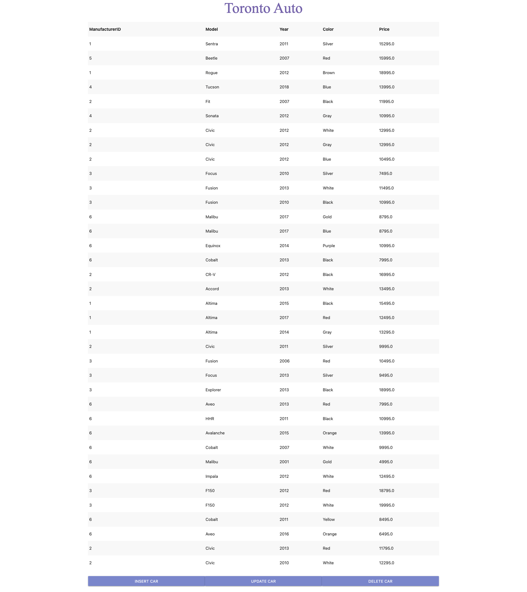
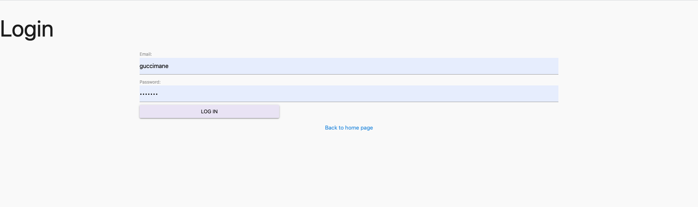
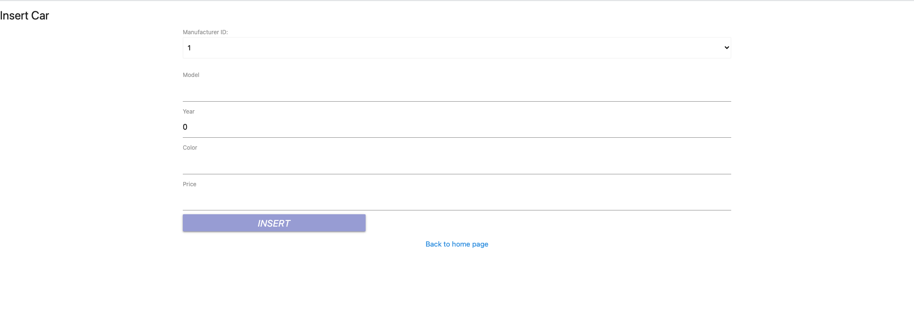
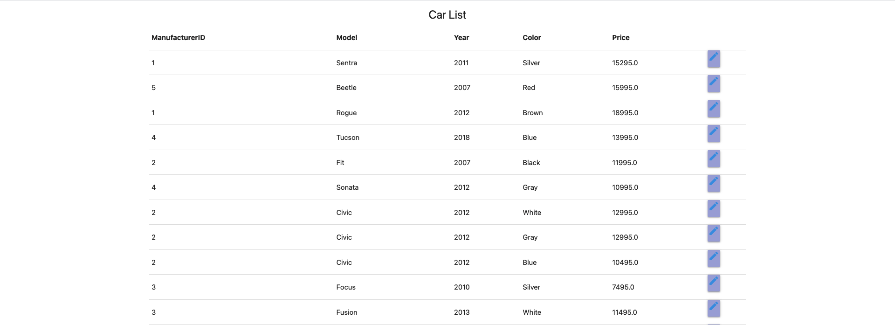
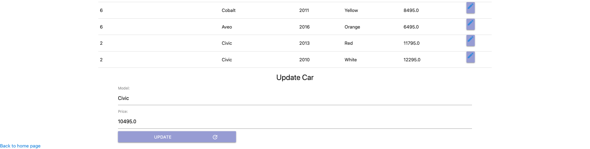

# 🚙 TorontoAuto
An auto dealer application that includes secured administrative features.

## Technologies
* [Spring Boot](https://docs.spring.io/spring-boot/docs/current/reference/htmlsingle/)
* [Java](https://docs.oracle.com/en/java/)
* [HTML](https://www.w3schools.com/TAgs/default.asp)
* [CSS](https://www.w3schools.com/css/default.asp)
* [JavaScript](https://www.w3schools.com/js/default.asp)
* [Google Fonts](https://fonts.google.com/)
* [MySQL](https://dev.mysql.com/doc/)
* [H2 Database](https://www.h2database.com/html/main.html)
* [Materialize CSS](https://materializecss.com/)

## Screenshots

## Room for improvement
* UX/UI designs for all pages need to be changed
* images for cars can be added

